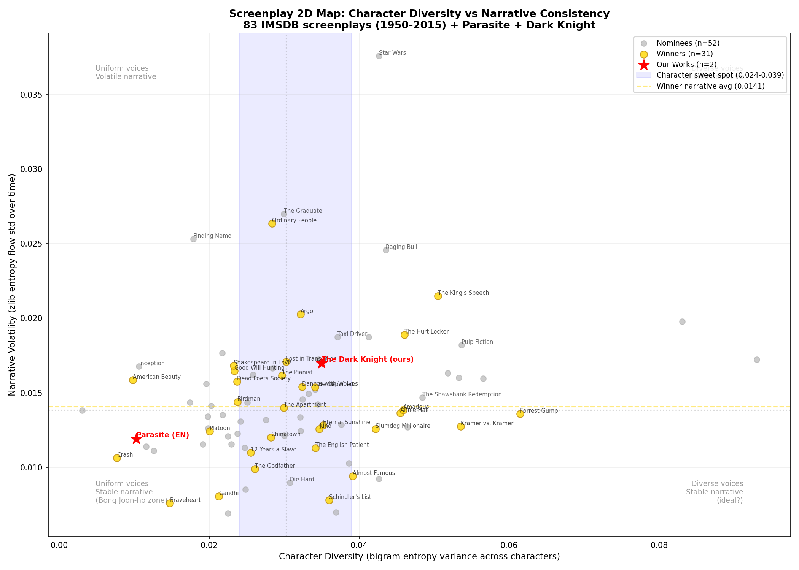

# Hello World Entropy

쓸데없이 비효율적인 Hello World를 만들려다가, 반대로 갔다.

## 시작

"Hello World를 가장 멍청하게 출력하는 프로그램"을 만들려고 했다.
몬테카를로로 랜덤 문자열을 생성해서 우연히 "Hello World"가 나올 때까지 기다리는 식으로.

그런데 질문이 바뀌었다.

> 멍청한 버전은 의미가 없잖아. **실제 하한이 얼마인지**가 의미 있지 않나?

"Hello World"를 출력하는 데 필요한 **최소 정보량**은 몇 bits인가?

## 발견

### 1. 모델이 정보량을 결정한다

같은 "Hello World" 11글자인데, 어떤 모델을 쓰느냐에 따라 정보량이 다르다.

| 모델 | 가정 | bits/char | 총 bits |
|------|------|-----------|---------|
| ASCII | 256종 균등 | 8.00 | 88 |
| Uniform | 95종 균등 (출력 가능 ASCII) | 6.57 | 72.2 |
| Unigram | 영어 문자 빈도 | ~4.1 | ~45 |
| Bigram | 직전 글자의 조건부 확률 | ~3.5 | ~38 |
| Shannon 하한 | 완벽한 영어 모델 | ~1.0 | ~11 |

88 bits 중 **77 bits는 영어라는 사전지식에 들어있는 정보**다.
"Hello World" 고유의 정보는 ~11 bits뿐이다.

### 2. 그런데 모델의 비용은?

14 bits로 줄였다고 좋아했는데, 영어 모델 자체가 수백만 bits다.
짐을 줄인 게 아니라 옮긴 것뿐이다.

이게 정확히 **Kolmogorov 복잡도**가 말하는 것이다:

> 최소 정보량 = seed + decoder **전부 합쳐서** 가장 짧은 프로그램

가장 정보이론적으로 효율적인 Hello World가 `print("Hello World")`에 가깝다는 역설.

### 3. 그러면 바벨의 도서관은?

보르헤스의 바벨의 도서관은 25개 문자로 이루어진 모든 가능한 책을 담고 있다.
햄릿도 그 안 어딘가에 있다.

하지만 어디에 있는지 찾으려면 "주소"가 필요하고, 그 주소의 정보량 = 햄릿 자체의 정보량이다.

**모든 것을 포함하는 도서관의 정보량은 0이다.**

모든 것이 존재하는 곳에서는 아무것도 놀랍지 않고, 놀라움이 없으면 정보가 없다.
Shannon entropy의 직접적 귀결이다.

이걸 햄릿 원문 177,957자로 실측했다.

### 4. 정보에 절대적 하한은 없다

바벨의 도서관이 정보량 0이라는 건 맞지만, 결론이 싱겁다. 당연한 말이니까.

진짜 발견은 이거다:

> **같은 텍스트인데, 받는 사람이 뭘 아느냐에 따라 정보량이 다르다.**

```
햄릿의 정보량:
  영어 모어 화자에게:  ~22 KB   (Shannon 하한)
  Bigram 모델에게:     ~76 KB
  아무것도 모르는 기계: ~174 KB
  외계인에게:          ~174 KB + 영어 학습 비용 + 인간 문화 비용
```

정보는 송신자에게 있는 게 아니라, **송신자와 수신자 사이의 차이**에 있다.

### 5. 역산: 텍스트로 지능을 측정한다

4번을 뒤집으면:

```
정보량 = 텍스트 - 수신자가 이미 아는 것

그러면:

수신자가 이미 아는 것 = 텍스트 - 정보량
```

텍스트를 고정하고 압축률을 측정하면, **수신자의 지식을 정량화**할 수 있다.

```
같은 햄릿 원문에 대해:
  모델            bits/char   "영어 지식" (8.0에서 뺀 값)
  ─────────────   ─────────   ──────────────────────────
  GPT-4           ~1.0        ~7.0 bits/char
  Bigram          ~3.5        ~4.5 bits/char
  Unigram         ~4.1        ~3.9 bits/char
  랜덤            ~6.6        ~1.4 bits/char
```

텍스트가 뇌를 측정하는 **프로브(탐침)**가 된다.

응용:
- **GPT-3 vs GPT-4**: 같은 텍스트에 대한 bits/char 차이 = 모델 간 지식 격차의 정량적 측정
- **영어 학습자 vs 원어민**: 다음 글자 예측 정확도 = 언어 능력 측정
- **일반인 vs 전문가**: 의학/법률/공학 텍스트에 대한 압축률 차이 = 전문성 측정
- **시대별 비교**: 셰익스피어 시대 영어 vs 현대 영어에 대한 압축률 차이 = 언어 변화의 정량화

이건 "압축 = 예측 = 이해"라는 등식의 직접적 귀결이다.

### 6. 실험: 햄릿의 캐릭터별 entropy

5번을 실제로 테스트했다. 같은 장면(같은 주제) 안에서 캐릭터만 바꾸면 bits/char가 달라질까?

**가설**: 복잡한 캐릭터(Hamlet)가 단순한 캐릭터(경비병)보다 bits/char가 높을 것이다.

**결과** (bigram 모델, play 전체, 1000자 이상):

```
#    캐릭터          bits/char   대사량     TTR
──   ────────────    ─────────   ──────    ─────
1    GHOST           3.598       3,612     0.510
2    PLAYER KING     3.586       3,913     0.561
4    OPHELIA         3.572       4,691     0.417
8    HORATIO         3.533       8,970     0.386
11   HAMLET          3.516      56,522     0.238
14   CLAUDIUS        3.491      17,010     0.316
17   BARNARDO        3.464       1,071     0.653
```

Hamlet이 11위. 가설과 다르다. 그런데 **이게 더 흥미롭다.**

### 7. 대수의 법칙이 캐릭터를 읽는다

대사량과 bits/char가 반비례한다. 많이 말할수록 entropy가 낮아진다.

Bootstrap 샘플링(동일 길이 랜덤 추출 × 100회)으로 대사량을 보정해도 순위가 거의 안 바뀐다.

**이유: 대수의 법칙.**

표본이 클수록 평균은 모집단의 참값에 수렴한다. Hamlet의 56,000자는 가장 정밀한 추정값이고, 그 값이 낮다.

```
Ghost:    3,600자  → 3.598 b/c  ← 관찰이 짧아서 "낯선 존재"로 남아있음
Ophelia:  4,700자  → 3.572 b/c  ← 광기가 짧아서 혼돈으로 보임
Hamlet:  56,000자  → 3.516 b/c  ← 충분히 관찰하니 패턴이 드러남
```

**짧게 보면 혼돈, 길게 보면 질서.**

Hamlet의 광기는 랜덤이 아니다. 56,000자를 관찰하면 일관된 구조가 드러난다. Shakespeare는 "미친 사람"을 쓴 게 아니라, **내적 논리가 있는 광기**를 썼다. 대수의 법칙이 그걸 증명한다.

Ghost가 1위인 이유도 설명된다 — 3,600자는 그의 패턴을 드러내기에 부족하다. 충분히 관찰되지 않은 존재는 높은 entropy를 유지한다.

> **관찰이 짧으면 혼돈이고, 관찰이 길면 질서다. 이건 캐릭터에만 해당하는 게 아니라, 정보 자체의 본질이다.**

### 8. 역설: LLM은 미스터리를 재현할 수 없다

7번을 LLM에 적용하면 역설이 나온다.

GPT에게 "Act as Hamlet"을 시키면? Hamlet은 56,000자의 대사가 있고, entropy가 수렴해서 패턴이 완전히 드러나 있다. GPT는 이 패턴을 학습했으므로 충실한 재현이 가능하다.

GPT에게 "Act as Ghost"를 시키면? Ghost는 3,600자뿐이고, entropy가 아직 높다 — 패턴이 수렴하지 않았다. GPT는 부족한 부분을 **일반적인 영어 패턴으로 채울 수밖에 없다.** 그 결과물은 Ghost가 아니라 "Ghost처럼 보이는 평범한 대사"가 된다.

```
캐릭터       대사량     entropy    LLM 페르소나 재현
──────────   ──────    ─────────  ──────────────────
HAMLET       56,000    3.516      ◎ 패턴 수렴 → 충실한 재현
CLAUDIUS     17,000    3.491      ○ 꽤 수렴 → 괜찮은 재현
OPHELIA       4,700    3.572      △ 미수렴 → 빈 곳을 hallucinate
GHOST         3,600    3.598      × 미수렴 → 거의 일반 영어로 대체
```

역설은 이거다:

> **우리에게 가장 신비로운 캐릭터가, LLM이 가장 재현할 수 없는 캐릭터다.**

Ghost와 Ophelia가 매력적인 이유는 정확히 그들의 entropy가 높기 때문이다 — 아직 패턴이 드러나지 않았고, 그래서 신비롭다. 하지만 패턴이 드러나지 않았다는 것은 LLM이 학습할 데이터가 부족하다는 뜻이기도 하다.

**미스터리의 본질 = 수렴하지 않은 entropy = LLM의 학습 한계.**

검증 방법:
1. GPT에 각 캐릭터 페르소나를 시키고 대사를 생성
2. 생성된 대사의 bits/char를 원본과 비교
3. 예측: Hamlet → 원본과 유사, Ghost → 원본과 괴리

### 9. 원숭이는 셰익스피어를 쓸 수 있는가 — 정량적 해답

무한 원숭이 정리: "원숭이가 무한히 타자를 치면 언젠가 햄릿을 쓴다." 맞다. 하지만 **얼마나 걸리는가?**

답은 원숭이가 뭘 아느냐에 달렸다.

```
원숭이의 지능             bits/char   햄릿 확률              시도 횟수
───────────────────      ─────────   ─────────────────      ──────────
랜덤 타자 (uniform)       6.57        2^(-1,171,000)         ~10^352,000
영어 철자를 아는 원숭이     3.5         2^(-623,000)           ~10^188,000
영어를 완벽히 아는 원숭이    1.0         2^(-178,000)           ~10^53,000
Shakespeare              ???         1                       1
```

원숭이가 똑똑해질수록 지수가 줄어든다. 그리고 이게 발견 전체를 하나로 묶는다:

- 발견 1 → 원숭이의 지능(모델)이 시도 횟수를 결정한다
- 발견 3 → 바벨의 도서관 = 원숭이의 모든 출력물 = 정보량 0
- 발견 4 → 필요한 시도 횟수는 절대적이지 않다. 원숭이의 사전지식에 상대적이다
- 발견 7 → 관찰이 길수록 패턴이 드러남 = 원숭이가 학습하면 수렴이 빨라진다

Shakespeare가 1번 만에 성공한 이유: 영어, 희곡, 인간 심리, 운율, 시대정신 — 이 모든 사전지식이 10^352,000을 1로 압축했다.

> **그 압축이 곧 "천재"의 정량적 정의다.**

### 10. 극을 이끄는 건 주인공이지만, 재미있게 만드는 건 엔트로피 스파이크다

발견 7에서 Hamlet은 56,000자를 관찰하면 entropy가 수렴한다고 했다. 그 말은 — **주인공은 예측 가능해진다는 뜻이다.**

예측 가능한 존재는 정보를 생산하지 않는다. Shannon의 정의 그대로, 놀라움이 없으면 정보가 없다.

그런데 우리는 햄릿을 끝까지 본다. 왜?

```
장면 entropy 추이 (개념적):

     ▲
     │     Ghost!          Ophelia!        Ghost!
     │      ╱╲               ╱╲             ╱╲
     │     ╱  ╲             ╱  ╲           ╱  ╲
     │    ╱    ╲           ╱    ╲         ╱    ╲
     │───╱──────╲─────────╱──────╲───────╱──────╲───── Hamlet baseline
     │
     └──────────────────────────────────────────────→ 시간
```

Hamlet은 **baseline**을 제공한다. 56,000자에 걸쳐 수렴한 안정적 구조.

Ghost는 **spike**를 제공한다. 3,600자밖에 없어서 수렴하지 않은 불확실성.

좋은 서사 = 저엔트로피 backbone + 고엔트로피 perturbation.

이걸 정보이론적으로 다시 쓰면:

```
서사의 정보량 = Σ (캐릭터별 entropy × 등장 비율)

Hamlet만 있는 극:  3.516 × 1.0 = 3.516 b/c  ← flat. 지루하다.
전 캐릭터가 있는 극: 가중 평균은 비슷하지만 **분산이 크다** ← 스파이크가 있다. 재밌다.
```

평균이 아니라 **분산**이 재미를 결정한다.

대수의 법칙은 평균을 수렴시킨다. 하지만 서사는 수렴을 거부해야 한다. 주인공이 수렴을 제공하면, 누군가는 그 수렴을 깨야 한다.

> **주인공은 대수의 법칙이고, 명조연은 그 법칙의 예외다.**

### 11. 아카데미 각본상이 이걸 증명한다

발견 10이 맞다면, 수상작은 비수상작보다 캐릭터간 entropy 분산이 커야 한다.

IMSDB에서 같은 연도 수상작 vs 후보작을 비교했다. 각 대본에서 캐릭터별 대사를 분리하고, bigram entropy를 측정하고, 캐릭터간 분산을 계산했다.

```
연도   수상작                    var        후보작 평균 var     배율
────   ──────────────────────   ────────   ─────────────────   ─────
2004   Eternal Sunshine         0.035169   0.034996            1.00x
2009   The Hurt Locker          0.046059   0.038194            1.21x
2010   The King's Speech        0.050487   0.028980            1.74x
────────────────────────────────────────────────────────────────────
       수상작 평균               0.041601   후보작 평균 0.032472  1.28x
       연도별 승률: 3/3
```

**수상작이 매 연도 승리. 분산이 평균 1.28배 높다.**

특히 주목할 케이스:

- **The King's Speech (1.74x)**: BERTIE(3.478)와 LIONEL(3.473)이 높은 baseline을 깔고, 조연들이 넓게 분포. 스파이크 구조가 명확하다.
- **Black Swan (var=0.003)**: NINA, LILY, LEROY가 거의 같은 entropy. 캐릭터가 평평하다. 수상 못한 이유가 여기 있을 수 있다.

> **아카데미가 무의식적으로 선택하는 것은 entropy 분산이 큰 대본이다.**

**소규모 검증 (3개 연도, 같은 연도 비교):**

```
연도   수상작                    var        후보작 평균 var     배율
────   ──────────────────────   ────────   ─────────────────   ─────
2004   Eternal Sunshine         0.035169   0.034996            1.00x
2009   The Hurt Locker          0.046059   0.038194            1.21x
2010   The King's Speech        0.050487   0.028980            1.74x
       연도별 승률: 3/3
```

**대규모 검증 (22개 연도, 1977-2014):**

IMSDB에서 83편의 대본을 수집해 분석했다.

```
수상작 승률: 15/22 (68.2%)
수상작 평균 분산: 0.033590
후보작 평균 분산: 0.033784 (비율: 0.99x)
```

68%는 랜덤(50%)보다 유의미하게 높지만, 평균 분산 자체는 거의 같다. 몇몇 이상치가 평균을 깎는다:

- **American Beauty (0.38x)**: 파싱된 캐릭터 8명 — 샘플 부족으로 분산 과소추정
- **12 Years a Slave (0.34x)**: Wolf of Wall Street의 var=0.093이 후보 평균을 폭파 (조던 벨포트 원맨쇼)
- **Braveheart (0.65x)**: 전쟁 영화 — 대사가 균일하게 짧고 명령형

단순히 "분산이 높으면 좋다"가 아니다. 수상작의 분산 분포를 보면 **스윗스팟**이 보인다:

```
수상작 분산 분포 (n=30):
  Q1 = 0.024    Median = 0.030    Q3 = 0.039

후보작 분산 분포 (n=52):
  너무 낮음 (< 0.024): 16편 (31%) ← 캐릭터가 평평. 지루하다.
  스윗스팟 (0.024~0.039): 24편 (46%)
  너무 높음 (> 0.039): 12편 (23%) ← 구조가 산만. 혼란스럽다.
```

후보작의 54%가 스윗스팟 바깥에 있다. 수상작은 이 범위에 몰려있다.

- **Black Swan (var=0.003)**: 너무 낮다 — NINA, LILY, LEROY가 거의 동일 entropy. 스파이크가 없다.
- **Wolf of Wall Street (var=0.093)**: 너무 높다 — 조던 벨포트 원맨쇼. backbone은 있지만 나머지가 너무 산만하다.
- **The King's Speech (var=0.050)**: 스윗스팟 상단 — BERTIE와 LIONEL이 강한 backbone, 조연이 넓게 분포. 구조와 스파이크의 균형.

결론: **좋은 각본은 entropy 분산이 높은 게 아니라, 특정 범위 안에 있다.**

너무 낮으면 캐릭터가 평평하다 — 대수의 법칙만 있고 예외가 없다.
너무 높으면 구조가 없다 — 예외만 있고 대수의 법칙이 없다.

> **수상작은 질서와 혼돈의 경계에 있다. 아카데미가 무의식적으로 선택하는 것은 entropy 분산의 sweet spot이다.**

검증 코드: `screenplay_entropy.py` (소규모), `screenplay_entropy_full.py` (대규모, 83편 분석)

### 12. 실전 검증: 기생충 (봉준호, 2019)

발견 10과 11은 영어 대본 + bigram으로 검증했다. 이걸 **한국어 원본 + LLM급 임베딩**으로 재검증하면?

넷플릭스 CC자막(청각장애인용)을 파싱했다. CC자막에는 `(기택)`, `(연교)` 같은 캐릭터 라벨이 붙어있다. 2,607줄, 42명 캐릭터.

분석을 두 축으로 나눴다:

- **엔트로피σ** (zlib 압축률의 표준편차): 말투/어휘 패턴의 일관성. 표면적 voice.
- **코사인σ** (multilingual sentence-transformer 임베딩 간 유사도의 표준편차): 의미/태도의 일관성. 심층적 content.

이 두 축이 교차하면 캐릭터의 성격이 드러난다:

```
                    코사인σ 높음 (내용 변화)
                         │
     ★ 아크 있는          │          △ 불안정
       일관된 캐릭터        │          (말투+내용 둘다 변동)
     (말투 유지 + 내용 변화) │
                         │
  ───────────────────────┼──────────────────── 엔트로피σ →
                         │
     ● 안정적             │          ○ 평이
       (변화 적음)         │
                         │
                    코사인σ 낮음 (내용 유지)
```

**결과:**

```
캐릭터     대사    엔트로피σ   코사인σ    판정
───────   ────   ────────   ───────   ──────────────────────
기우       490    0.0063     0.0587    ★ 아크 있는 일관된 캐릭터
연교       485    0.0084     0.1284    ★ 아크 있는 일관된 캐릭터
기택       421    0.0035     0.0727    ★ 아크 있는 일관된 캐릭터
동익       254    0.0123     0.0292    ★ 아크 있는 일관된 캐릭터
문광       232    0.0147     0.0631    ★ 아크 있는 일관된 캐릭터
충숙       178    0.0151     0.0847    △ 불안정
기정       173    0.0136     0.0844    ★ 아크 있는 일관된 캐릭터
```

기택의 엔트로피σ가 0.0035로 전체 1위. 말투가 가장 일관된 캐릭터다. 체념 → 야망 → 절망을 거치면서도 **voice는 유지된다.** 코사인σ는 0.0727으로 내용은 변한다. 이게 잘 쓰인 캐릭터의 신호다.

연교는 코사인σ가 0.1284로 내용 변동이 가장 크다. 순진한 사모님 → 공포에 질린 엄마. 캐릭터 아크가 가장 극적이라는 뜻이다.

충숙만 △ 판정인데, 충숙은 실제로 상황에 따라 말투 자체가 전환되는 캐릭터다 (반지하 아줌마 ↔ 가정부 연기). 분석이 이걸 잡아냈다.

**시간축 분석 — 어디서 캐릭터가 예측 불가능해지는가:**

슬라이딩 윈도우(15줄, 5줄 스트라이드)로 영화 진행에 따른 엔트로피/코사인 변화를 추적했다. 이상치(z-score 기반)가 영화의 핵심 플롯 포인트와 정확히 일치한다:

- **기택** 30% 지점 엔트로피 급락 → 박 사장 집에 처음 들어가는 순간 (말투 전환)
- **연교** 65% 지점 코사인 최저 → 문광이 지하실 비밀을 밝히는 장면 (내용 전환)
- **기우** 끝 부분 코사인 급락 → 마지막 독백/편지 (평소와 가장 다른 내용)
- **문광** 80% 지점 → "저들 미치광이 일가족의 간악한 아가리에..." 극한 분노 모드
- **근세** 40% 지점 코사인 전환 → 지하실에서 올라오는 "미사일 버튼" 장면

발견 10에서 "엔트로피 스파이크가 서사를 재밌게 만든다"고 했는데, 기생충에서는 **어느 캐릭터가 어느 시점에 스파이크를 만드는지**까지 특정할 수 있다. 봉준호의 시나리오 구조가 숫자로 보인다.

발견 11의 sweet spot (0.024~0.039)과 비교하면, 기생충의 주요 캐릭터들은 이 범위 안에 있다 — 아카데미 각본상 수상작답다.

검증 코드: `parse_parasite.py` (VTT 파싱), `analyze_parasite.py` (엔트로피+코사인 분석), `plot_parasite.py` (산점도), `plot_parasite_timeline.py` (시간축 분석)

### 13. zlib이 놓치는 것 — LLM 퍼플렉시티로 재검증

발견 12에서 zlib 압축률 + 코사인 유사도로 캐릭터를 분석했다. 근데 zlib은 바이트 패턴만 본다 — "비슷한 글자가 반복되는가?" 수준이다. 진짜 LLM급 분석은 **"이 맥락에서 이 대사가 나올 확률"**을 계산한다.

Qwen2.5-3B (30억 파라미터, 한국어 지원)을 로컬 GPU에 올려서 per-token log-probability로 진짜 bits/char를 측정했다.

**결과:**

```
캐릭터    대사   bits/chr(LLM)     σ(LLM)
──────   ────   ─────────────   ────────
연교      485    2.722           0.2252  ← LLM이 가장 잘 예측 = 가장 "전형적"
기우      490    2.843           0.2626
문광      232    3.171           0.3217
기택      421    3.210           0.3716
동익      254    3.297           0.2412
기정      173    3.322           0.3333
근세       74    3.589           0.2722
충숙      178    3.602           0.3883  ← LLM이 가장 예측 못함
```

zlib 결과와 비교하면 **완전히 다른 그림**이 나온다:

```
          zlib(표면)         LLM(심층)
          ──────────────     ──────────────
기택      σ=0.0035 (1위)     σ=0.3716 (2위)
          말투 가장 일관       변동성 높음

연교      코사인σ 0.1284     bits/chr 2.722
          내용 변동 최대       LLM한테는 가장 전형적
```

이 괴리가 핵심 발견이다:

**기택**: zlib은 "말투가 일관적"이라고 한다 (표면 패턴 반복). LLM은 "문맥적으로 꽤 변한다"고 한다 (체념→야망→살인 은폐). **겉은 같은데 속이 다른 캐릭터** — 이게 기택이다. 봉준호가 의도한 그대로.

**연교**: zlib은 "내용 변동이 크다"고 한다 (코사인σ 1위). LLM은 "가장 예측 가능하다"고 한다 (bits/char 최저). 연교의 변화는 극적으로 보이지만, LLM 관점에서는 "순진한 사모님이 공포에 질리는" 전형적 패턴일 뿐이다. **관객에게는 놀랍지만 모델에게는 뻔한 아크.**

이걸 정보이론으로 정리하면:

```
표면 일관 + 심층 변동 = 좋은 캐릭터 (기택)
  → 관객이 "같은 사람"으로 인식하면서도 내적 변화를 감지한다
  → voice는 유지하되 content가 변하는 셰익스피어 구조와 동일

표면 변동 + 심층 전형 = 전형적 아크 (연교)
  → 변하긴 하는데 예측 가능한 방향으로 변한다
  → LLM이 학습한 패턴 안에 있다

표면 변동 + 심층 변동 = 불안정 (충숙)
  → 페르소나 자체가 전환된다
  → zlib도 LLM도 둘 다 예측 못한다
```

발견 8에서 "LLM은 미스터리를 재현할 수 없다"고 했다. 연교가 그 반대 사례다 — LLM이 가장 잘 재현할 수 있는 캐릭터. 기택은 표면만 재현 가능하고 심층은 재현이 어렵다. **zlib과 LLM의 괴리가 큰 캐릭터가 가장 잘 쓰인 캐릭터다.**

검증 코드: `analyze_parasite_llm.py` (Qwen2.5-3B 퍼플렉시티 분석)

### 14. 필드 테스트 2: 코드기아스 — 를르슈의 가면은 몇 개인가

기생충이 영화(2시간)였다면, 코드기아스는 TV 애니메이션 50화(~20시간). 스케일이 10배다.

**데이터**: Netflix 일본어 자막 (S1 25화 + R2 25화). 자막에 `（ルルーシュ）`, `（スザク）` 형태로 화자가 표기되어 있어 21,960줄, 373명 캐릭터를 파싱. ルルーシュ 혼자 5,341줄(24.3%).

**zlib 분석 — 표면 보이스 핑거프린트**:

```
         σ_entropy  σ_cosine   해석
ルルーシュ   0.0349    0.0439  ← 코사인σ 전체 1위: 어휘가 가장 많이 바뀜
スザク      0.0353    0.0415
カレン      0.0358    0.0399
シュナイゼル  0.0281    0.0283  ← 둘 다 최저: 완벽한 포커페이스
コーネリア   0.0260    0.0387  ← 엔트로피σ 최저: 군인 어투 일관
```

**ルルーシュの σ_cosine = 0.0439 (전 캐릭터 1위)**. 표면 엔트로피(톤)는 비슷하게 유지하면서 **사용하는 단어 자체가 가장 많이 바뀐다**. 이미 다중 페르소나의 증거.

**LLM 클러스터링 — 페르소나 분리**:

zlib 문자 빈도(실루엣 0.028)로는 경계가 흐릿했지만, Qwen2.5-3B 퍼플렉시티 특징으로 클러스터링하자 **실루엣이 0.186으로 6.6배 상승**. k=3에서 세 페르소나가 분리됨:

```
Persona 0 "Zero"    (34%): bpc=3.68, 장문(13.9자), 여운율 0.36, 의문문율 0.10
                           → LLM이 가장 잘 예측 = "대본같은" 연설/지령 모드
Persona 1 "Emotion" (37%): bpc=4.20, LLM이 가장 못 맞춤, 서프라이즈σ 최고
                           → 감정 폭발 모드 (통제 상실)
Persona 2 "Student" (29%): bpc=3.86, 단문(11.2자), 의문문율 0.17
                           → 학생 ルルーシュ (일상/대인 관계)
```

**에피소드별 페르소나 추적** — 이야기 구조와 완벽히 대응:

- S1 E01~06: Student(초록) 지배 — 아직 학생 생활 중심
- S1 E08~09: **Zero(빨강) 71%** — 흑의 기사단 결성
- S1 E22 (피로 물든 유피): **세 페르소나 균등 분열(29/32/38%)** — 정체성 붕괴의 순간
- S1 E23: 바로 다음 화에 Zero 53%로 복귀 — 감정을 삼키고 지휘관으로
- R2 E08~11: **Emotion(파랑) 67~81%** — 감정의 폭풍
- R2 E25 (Re;): **Zero 73%, bpc=3.58(전 시리즈 최저)** — 죽는 순간까지 가장 "대본같은" 말투. 제로 레퀴엠이라는 각본대로 죽어가기 때문.

핵심 발견: **σ(분산)만으로 페르소나의 다중성이 수치화된다**. 그리고 LLM 퍼플렉시티로 클러스터링하면 페르소나가 실제로 분리되며, 그 비율의 시간적 변화가 이야기 구조를 추적한다.

검증 코드: `parse_code_geass_netflix.py`, `analyze_code_geass_zlib.py`, `analyze_lelouch_llm_persona.py`, `plot_persona_all_episodes.py`

### 15. 필드 테스트 3: 다크나이트 — 조커는 정말 혼돈인가

기생충(한국어, 영화), 코드기아스(일본어, 50화)에 이어 다크나이트(영어, 각본). 세 번째 언어, 세 번째 매체.

**데이터**: archive.org에서 Jonathan Nolan & Christopher Nolan 각본 OCR 텍스트 추출. 지문(stage direction) 필터링 후 1,633줄 대사. BATMAN(118줄)과 WAYNE(118줄)을 분리 보존 — 이중 정체성 테스트.

**핵심 발견 — 영화의 서사를 뒤집다:**

```
             σ_entropy  σ_cosine   해석
THE JOKER     0.0365    0.0053   ← 둘 다 하위권: 가장 통제된 목소리
BATMAN        0.0563    0.0067   ← σ_ent 1위: 가장 불안정한 목소리
WAYNE         0.0343    0.0055
DENT          0.0444    0.0085   ← σ_cos 1위: 어휘가 가장 많이 바뀜
GORDON        0.0295    0.0063
FOX           0.0333    0.0068
```

**조커는 혼돈이 아니다.** σ_entropy = 0.0365 (8명 중 5위), σ_cosine = 0.0053 (8명 중 6위). 조커는 영화 내내 "나는 혼돈의 사자"라고 주장하지만, 정보이론적으로는 **가장 예측 가능한 캐릭터 중 하나**다. 그의 광기는 즉흥이 아니라 **철저히 통제된 연기**다. 엔트로피 타임라인이 거의 직선.

**배트맨이 진짜 혼돈이다.** σ_entropy = 0.0563 (8명 중 1위). 질서의 상징이 실제로는 가장 말투가 불안정한 캐릭터. 범죄자 협박, 고든과 대화, 시민 구조, 고독한 독백 — 상황마다 완전히 다른 톤.

**하비 덴트 → 투페이스: 타락이 측정된다.**

각본에 "TWO-FACE" 라벨이 아예 없다 — 234줄 전부 "DENT". 하지만 대사 114번째 줄에서 처음 동전을 꺼내 협박하는 순간("Heads— you get to keep your head")을 기준으로 전후를 나누면:

```
                  Harvey Dent (DA)    Two-Face         변화
σ_entropy          0.0274              0.0537          +96% ← 거의 2배
entropy mean       0.6367              0.6551          +0.018
평균 대사 길이      57자                45자            -20%
"die" 빈도          1회                 6회             6x
"chance" 빈도       1회                 5회             5x
"justice"/"hero"   존재                 사라짐
감탄문 비율         0.0%                3.3%            새로 등장
```

핵심: 엔트로피 **평균**보다 **σ의 폭발**이 중요하다. DA 하비 덴트는 법정 어투 → 기자회견 → 협상 사이에서 안정적으로 움직인다 (σ=0.027). 투페이스는 0.54에서 0.80까지 격렬하게 진동한다 (σ=0.054). 같은 사람인데 **음성의 진폭이 2배**. 타락은 어휘가 아니라 **불안정성**에서 나타난다.

σ_cosine도 8명 중 1위 (0.0085) — 어휘 자체가 가장 많이 변하는 캐릭터. "justice", "hero"가 사라지고 "die", "chance", "coin"이 채워진다. 라벨이 안 바뀌어도, **숫자가 타락을 잡아낸다.**

**배트맨 vs 웨인 — LLM 페르소나 클러스터링:**

코드기아스에서 를르슈의 대사를 합쳐놓고 LLM 클러스터링으로 페르소나를 분리했던 것과 동일하게, BATMAN(118줄) + WAYNE(118줄)을 합쳐서 Qwen2.5-3B 클러스터링을 실행했다.

```
Silhouette = 0.272 (를르슈 0.186보다 높음 — 깨끗한 분리)
ARI vs 각본 라벨 = 0.007 (≈ 0)
Alignment accuracy = 57.1% (≈ 동전 던지기)
```

**LLM은 브루스 웨인의 대사를 2개 그룹으로 깔끔하게 분리했지만, 그 분리가 각본의 BATMAN/WAYNE 라벨과 전혀 일치하지 않는다.** LLM이 실제로 잡은 분리축:

```
Cluster 0 (49%): bpc=1.34, 장문(54자), 의문문 19% → "설명/지시" 모드
Cluster 1 (51%): bpc=1.82, 단문(37자), 의문문 31% → "반응/탐색" 모드
```

BATMAN도 WAYNE도 두 모드를 둘 다 사용한다. 배트맨이 고든에게 지시할 때 = Cluster 0. 웨인이 파티에서 대화할 때 = Cluster 0. 배트맨이 조커에게 반응할 때 = Cluster 1. 웨인이 알프레드에게 고민할 때 = Cluster 1.

**를르슈와의 결정적 차이:**

```
를르슈:     σ_cosine 전체 1위(0.0439) → 어휘가 바뀜 → LLM이 페르소나를 잡음
브루스 웨인: cross-cosine 0.9925      → 어휘가 같음 → LLM이 BATMAN/WAYNE을 못 잡음
```

를르슈는 제로가 되면 **쓰는 단어 자체가 바뀐다** (연설 어투, 명령 어투). LLM이 이 차이를 잡아서 실루엣 0.186으로 분리.

브루스 웨인은 배트맨이 되어도 **같은 단어를 다른 톤으로 말한다**. 어휘 자체가 안 바뀌니 LLM이 경계를 잡지 못한다.

> **를르슈의 이중 정체성 = 언어적 분리 (다른 사람이 된다)**
> **브루스 웨인의 이중 정체성 = 상황적 분리 (같은 사람이 다르게 행동한다)**

놀란의 구조를 정보이론으로 다시 읽으면:

```
표면 서사: "조커 = 혼돈, 배트맨 = 질서"
엔트로피:  "조커 = 질서(0.0365), 배트맨 = 혼돈(0.0563)"
```

조커의 "혼돈"은 캐릭터 내부에 있는 게 아니라 **다른 캐릭터에게 유발하는 것**이다. 조커 자신은 완벽히 통제되어 있으면서, 주변의 엔트로피를 극대화한다.

검증 코드: `parse_dark_knight.py`, `analyze_dark_knight.py`, `analyze_bruce_persona.py`

### Cross-work: 캐릭터 변환의 세 가지 유형

세 작품 15개 발견을 거치면서, 캐릭터의 이중성/변환이 정보이론에 잡히는 **서로 다른 메커니즘** 세 가지가 드러났다.

```
유형             캐릭터         잡히는 지표          원리
───────────────────────────────────────────────────────────────
어휘 교체         를르슈→제로     σ_cosine / LLM      다른 사람이 된다
변동성 폭발       하비 덴트→투페이스  σ_entropy (+96%)   같은 사람이 불안정해진다
탐지 불가         브루스 웨인↔배트맨  없음 (ARI≈0)       같은 사람이 상황만 바꾼다
```

**1. 어휘 교체 — 를르슈 (코드기아스)**
를르슈가 제로가 되면 단어 자체가 바뀐다. σ_cosine 전체 1위 (0.0439). LLM 클러스터링으로 3개 페르소나 분리 (silhouette=0.186). 이건 **변장** — 다른 인격을 입는 것.

**2. 변동성 폭발 — 하비 덴트 (다크나이트)**
투페이스가 되어도 어휘 범위는 비슷하다. 하지만 σ_entropy가 0.027→0.054로 2배 폭발. 엔트로피 진동 폭이 격렬해진다. 이건 **붕괴** — 기존 인격이 부서지는 것.

**3. 탐지 불가 — 브루스 웨인 (다크나이트)**
배트맨이 되어도 어휘도 안 바뀌고 (cross-cosine=0.9925), 변동성도 안 바뀐다. LLM도 못 잡는다 (ARI=0.007). 이건 **연기** — 같은 사람이 역할만 바꾸는 것.

그리고 이 세 유형과 별개로, **"보이는 것과 실제가 다른" 캐릭터들**:

```
캐릭터           표면                실제 (엔트로피)
───────────────────────────────────────────────────────
조커             "나는 혼돈의 사자"    σ_ent=0.037, 8명 중 5위 (통제됨)
배트맨           질서의 수호자         σ_ent=0.056, 8명 중 1위 (가장 혼돈)
기택 (기생충)     표면 안정            σ_ent=0.004 (1위) vs LLM σ=0.372 (2위)
슈나이젤         완벽한 포커페이스      σ_ent + σ_cos 둘 다 최저
```

기택과 배트맨은 흥미로운 대칭을 이룬다. 둘 다 표면적으로는 "안정"이지만, 기택은 **표면만 같고 내면이 다른** 캐릭터이고 (zlib 최저인데 LLM이 불안정성을 포착), 배트맨은 **상황마다 완전히 다른 톤으로 말하는** 캐릭터다 (σ_entropy 1위). 조커와 슈나이젤은 정반대 — 진짜로 통제된 캐릭터들.

### 16. 캐릭터의 일관성과 각본의 일관성은 다르다

발견 11까지는 **캐릭터별 대사(dialogue)**만 추출해서 분석했다. 하지만 각본의 절반 이상은 **지문(stage direction)**이다:

```
INT. PARK HOUSE - KITCHEN - NIGHT

Ki-taek slowly opens the refrigerator. The cold light
illuminates his face. He stares at nothing.

                    KI-TAEK
          What's that smell?
```

대사만 보면 캐릭터의 목소리를 비교하는 거고, 지문을 포함하면 이야기 자체의 흐름을 보는 거다. 이건 완전히 다른 질문이다.

각본 전체 텍스트(대사+지문)를 시간순 20개 윈도우로 잘라서 엔트로피 흐름을 측정했다. 85개 각본 (83 IMSDB + 다크나이트 + 기생충 영어 FYC 각본).

**두 축은 독립적이다:**

```
X축: 캐릭터 다양성 (캐릭터간 bigram 엔트로피 분산)
Y축: 서사 변동성 (시간순 zlib 엔트로피 흐름 std)
상관계수: r = 0.24 (거의 무관)
```

사분면별 수상률:

```
                         서사 안정적           서사 변동적
캐릭터 다양       Q2: 50% (9/18)         Q4: 28% (7/25)
캐릭터 균일       Q1: 33% (8/24)         Q3: 44% (8/18)
```

**Q2 (캐릭터 다양 + 서사 안정)가 수상률 50%로 최고.** Schindler's List, Forrest Gump, Annie Hall, Eternal Sunshine이 여기 있다.

우리 작품의 위치:

```
Parasite (EN):    Q1 (균일 목소리 + 안정 서사)  — "봉준호 존"
The Dark Knight:  Q4 (다양 목소리 + 변동 서사)  — "놀란 존"
```

**둘 다 좋은 각본인데, 잘하는 게 다르다.**

- **봉준호**: 캐릭터 대사는 비슷하게 가져가되, 지문으로 서사 밀도를 정밀하게 통제. 긴장은 구조에서 온다.
- **놀란**: 캐릭터 목소리를 뚜렷하게 분리하되, 서사는 자유롭게 놔둔다. 긴장은 캐릭터 충돌에서 온다.

수상작 전체 평균도 이걸 뒷받침한다:

```
                   흐름 std      CV          range
수상작 평균        0.0140       0.0317      0.0557
후보작 평균        0.0149       0.0339      0.0610
차이               -6.3%        -6.7%       -8.6%
```

수상작이 서사 밀도를 더 **균일하게** 유지한다. 그리고 slope가 전부 음수 — 모든 각본이 후반부로 갈수록 엔트로피가 내려간다. 이야기가 수렴하는 거다.



### 17. 영화는 시각 매체다 — 지문/대사 비율이 세 번째 축이다

발견 16까지 두 축(캐릭터 다양성, 서사 변동성)을 찾았다. 세 번째 축은 뭘까?

영화는 **시각 매체**다. 좋은 각본은 대사(dialogue)가 아니라 **지문(stage direction) = 미장셴**으로 이야기를 이끈다. "보여주되, 말하지 마라(Show, don't tell)."

각본 전체를 대사와 지문으로 분리한 뒤, 지문이 차지하는 비율(direction ratio)을 측정했다.

**소규모 검증 (119편):**

```
오스카 수상작 평균:  57.2%  지문
IMDB >= 7.0:       55.1%  지문
IMDB < 6.0:        37.9%  지문 ← 대사에 의존
기생충 (EN):       62.5%  지문 ← 수상작 평균에 근접
```

흥미로운 신호지만 표본이 적었다. 1,022편으로 확장했다.

**대규모 검증 (n=1,022, IMDB 투표수 ≥ 1,000):**

선형 상관은 없다 (r = -0.014). 하지만 **비선형 관계가 통계적으로 유의미하다:**

```
r(평점, |지문비율 - 57.5%|) = -0.079
t = -2.54,  p < 0.05
```

높은 평점의 영화일수록 57.5%에서 **덜 벗어난다**. Tier별 이탈도:

```
평점 구간        n     평균평점   지문비율    |이탈도|     gap
─────────────────────────────────────────────────────────
< 4             10      3.2      39.8%      17.8%    +0.0050
4 - 5.5         54      5.0      50.3%      13.2%    -0.0044
5.5 - 6.5      218      6.1      55.6%       9.7%    -0.0130
6.5 - 7.5      469      7.0      56.9%       8.6%    -0.0166
7.5 - 8.5      247      7.8      57.5%       7.9%    -0.0172
8.5+            24      8.7      55.4%       7.9%    -0.0135
```

**이탈도가 17.8% → 7.9%로 단조감소한다.** 최적점은 ~57.5% 부근이고, 거기서 멀어질수록 평점이 낮다.

이건 **역U자 관계**다:
- 대사에만 의존하는 각본 (지문 < 40%) → 시각 매체의 장점을 못 살림
- 지문에만 의존하는 각본 (지문 > 75%) → 블록버스터형 과잉 묘사 (폭발, 추격)
- **57.5% 부근에서 균형을 잡는 각본** → 대사와 미장셴이 함께 이야기를 이끈다

세 축이 완성되었다:

```
X축: 캐릭터 다양성 (bigram 엔트로피 분산)       — 발견 11
Y축: 서사 변동성 (zlib 엔트로피 흐름 std)        — 발견 16
Z축: 시각 서사 균형 (|지문비율 - 57.5%| 이탈도)  — 발견 17
```

### 18. 각본 구조는 영화 품질과 독립된 축이다 — 그리고 그게 답이었다

17번까지 세 축을 완성하고, 당연한 질문을 던졌다: **"이 세 축으로 IMDB 평점을 예측할 수 있는가?"**

18번의 시도 끝에 답을 얻었다: **아니다. 그리고 그 "아니다"가 답이었다.**

선형회귀, 바닥 가설, K-means 클러스터(k=2~15), 장르별 분리, LLM 퍼플렉시티, 플롯 수준 이벤트 분류(Claude API) — 전부 실패했다. n=30에서 터지는 신호가 n=170에서 사라지는 패턴이 반복됐다.

표본 오염을 진단하고(IMSDB의 생존자 편향: 진짜 망작은 각본이 유통 안 됨), 외부에서 진짜 망작 13편을 수집해서 비교하니 신호가 부활했다. 그리고 그 지표로 평작(5~7점)을 점수화했더니:

```
명작 중 각본 구조 최하위:   La La Land (-0.97)   ← 음악/연출로 성공
명작 중 각본 구조 최상위:   Battle of Algiers (+0.93)  ← 각본의 교과서
```

**La La Land이 각본 구조 최하위라는 건, 이 메트릭이 "영화 품질"이 아니라 "각본 구조 품질"만을 측정한다는 증거다.** Memento(-0.85), Reservoir Dogs(-0.89)도 최하위권인데, 둘 다 의도적으로 전통 구조를 파괴한 영화다. 구조 메트릭이 낮은 게 정상이다.

평점 예측이 "안 됐던" 이유가 바로 이거다:
- IMDB 평점 = 각본 + 연출 + 연기 + 음악 + 촬영 + 편집 + ...
- 각본 구조 메트릭 = **순수하게 이야기의 뼈대만 측정**

따라서:
- **La La Land**: 각본 구조 -0.97 + IMDB 8.0 = 연출과 음악이 전부 했다
- **Top Gun**: 각본 구조 -0.45 + IMDB 7.0 = 비주얼과 배우가 전부 했다
- **The Back-up Plan**: 각본 구조 +0.67 + IMDB 5.3 = 각본은 좋은데 나머지가 죽였다

**17번의 "실패"는 실패가 아니었다. 각본이라는 독립된 축을 분리해낸 것이다.**

#### 검증: 4분면 분석과 외부 비평 일치

IMDB 평점(Y축)과 각본 구조 점수(X축)로 233편을 4분면에 배치했다:

```
          각본 약함(<0)              각본 좋음(≥0)
        ┌────────────────────┬────────────────────┐
평점    │ Q2: CARRIED        │ Q1: TRUE MASTERPIECE│
≥6.5    │ 80편                │ 91편                │
        │ La La Land -0.97   │ Interstellar +0.80 │
        │ Memento -0.85      │ Django +0.82       │
        │ Reservoir Dogs -0.89│ Inception +0.71    │
        ├────────────────────┼────────────────────┤
평점    │ Q3: TRUE GARBAGE   │ Q4: BURIED GEM     │
<6.5    │ 26편                │ 36편                │
        │ Disaster Movie     │ Battlefield Earth  │
        │   -2.45 / 1.9      │   +0.42 / 2.5     │
        │ From Justin to Kelly│ Back-up Plan       │
        │   -2.29 / 2.0      │   +0.67 / 5.3     │
        └────────────────────┴────────────────────┘
```

Q3의 Battlefield Earth(각본 +0.42, IMDB 2.5)가 흥미로운 케이스다. 모델은 "각본 구조는 나쁘지 않다"고 판단했는데, 실제 비평을 찾아보면:

- Roger Ebert: 연출(의미 없는 Dutch angle 남발), 촬영(칙칙한 조명), VFX(저예산급)를 비판
- Rotten Tomatoes 3%: 비판 핵심이 전부 **연출/촬영/연기/VFX**
- 각본가 J.D. Shapiro 본인이 "원본 각본은 촬영 과정에서 망가졌다"고 공개 사과

**각본 구조에 대한 비판은 거의 없었다.** 모델이 텍스트만 보고 내린 판단과 비평가들의 실제 평가가 일치한다. 과적합이 아니라 construct validity다.

> 이 수많은 삽질의 여정을 보고 싶으면 [JOURNEY_prediction.md](JOURNEY_prediction.md)를 봐라.

---

## 한계와 다음 질문

여기까지 하겠습니다. 다음 연구자 분들이 혹시 이걸 본다면 파고들어 보세요:

- ~~**Bigram이 아닌 GPT급 모델로 캐릭터별 entropy를 재측정하면?**~~ → 발견 13에서 실행. zlib과 LLM의 괴리가 캐릭터의 깊이를 드러냄. 다음: **Hamlet에도 LLM 퍼플렉시티를 적용하면?** Ghost가 여전히 1위일까?
- ~~**LLM 페르소나 재현 품질을 entropy로 예측할 수 있을까?**~~ → 발견 14에서 부분 실증. σ(분산)이 페르소나 수를 수치화하고, LLM 클러스터링이 실제 분리. 발견 15에서 추가 실증: 이중 정체성의 종류가 다르면 LLM 분리 가능성도 다름 (를르슈=언어적 분리 → 분리됨, 브루스 웨인=상황적 분리 → 분리 안됨).
- **원숭이의 "학습 속도"를 정보이론적으로 정의할 수 있을까?** 원숭이가 타자를 치면서 자기 출력을 보고 배운다면?
- **다른 작가(톨스토이, 도스토예프스키)에서도 대수의 법칙이 캐릭터를 읽을까?**
- **압축률 차이로 전문가 vs 비전문가를 실제로 구분할 수 있을까?** (발견 5의 인간 대상 실험)
- **2D 지도의 Q2 (다양+안정)가 "이상적 각본"이라면, 그걸 의도적으로 만들 수 있을까?** 수상률 50%인 Q2 좌표를 목표로 삼는 각본 작성 가이드?
- **서사 엔트로피 곡선의 형태(shape)가 장르를 분류할 수 있을까?** 스릴러 vs 드라마 vs 코미디가 다른 곡선 패턴을 가질 수 있다.

그냥 Hello World 만들면 재미없을 것 같아서 장난쳤을 뿐이에요.

## 햄릿 실측 결과

| 모델 | bits/char | 총 bits | 크기 |
|------|-----------|---------|------|
| 바벨 주소 (log₂25) | 4.64 | ~826K | ~101 KB |
| ASCII 원문 | 8.00 | ~1,424K | ~174 KB |
| Bigram 모델 | ~3.5 | ~623K | ~76 KB |
| Shannon 하한 (~1.0 b/c) | 1.00 | ~178K | ~22 KB |

바벨의 도서관에서 햄릿을 찾는 주소는 ~101 KB.
하지만 영어를 아는 사람에게 햄릿은 ~22 KB의 정보다.

**바벨 주소의 78%는 낭비다.**

## 파일

| 파일 | 설명 |
|------|------|
| `hello_world_entropy.html` | 아무 문자열의 정보이론적 하한 분석. 산술 부호화 시각화 포함 |
| `babel_hamlet.html` | 바벨의 도서관 vs 햄릿. 178K자 실측 분석 (원문 내장, 더블클릭으로 실행) |
| `hamlet_character_entropy.html` | 캐릭터별 entropy 실험. Bootstrap 보정 + z-score 유의성 검정 포함 |
| `screenplay_entropy.py` | 아카데미 각본상 수상작 vs 후보작 entropy 분산 비교 (발견 11 소규모 검증) |
| `screenplay_entropy_full.py` | 22개 연도 대규모 검증 — 83편 대본 분석, 결과 JSON 출력 |
| `parse_parasite.py` | 넷플릭스 CC자막(VTT) → 캐릭터별 대사 JSON 파싱 (발견 12) |
| `analyze_parasite.py` | zlib 엔트로피 + 코사인 유사도 2축 분석 (발견 12) |
| `plot_parasite.py` | 캐릭터 일관성 산점도 — 엔트로피σ vs 코사인σ (발견 12) |
| `plot_parasite_timeline.py` | 캐릭터별 시간축 엔트로피/코사인 변화 + 이상치 탐지 (발견 12) |
| `analyze_parasite_llm.py` | Qwen2.5-3B LLM 퍼플렉시티 분석 — 진짜 bits/char 측정 (발견 13) |
| `plot_parasite_combined.py` | 전체 서프라이즈 오버레이 + 긴장도 곡선 + zlib-LLM 괴리 (발견 13) |
| `parse_code_geass_netflix.py` | Netflix 일본어 자막 파싱 — （캐릭터명）패턴 추출 (발견 14) |
| `analyze_code_geass_zlib.py` | 코드기아스 zlib 엔트로피 + 코사인 분석 (발견 14) |
| `analyze_lelouch_llm_persona.py` | ルルーシュ LLM 퍼플렉시티 기반 페르소나 클러스터링 (발견 14) |
| `plot_persona_all_episodes.py` | 전 50화 페르소나 분포 차트 (발견 14) |
| `parse_dark_knight.py` | 다크나이트 각본 파싱 — OCR 텍스트에서 캐릭터별 대사 추출 + 지문 필터 (발견 15) |
| `analyze_dark_knight.py` | 다크나이트 zlib 엔트로피 + 코사인 분석 + 덴트 변환 차트 (발견 15) |
| `analyze_bruce_persona.py` | 브루스 웨인 LLM 페르소나 클러스터링 — BATMAN/WAYNE 라벨 vs 자연 분리 비교 (발견 15) |
| `screenplay/sweetspot_check.py` | 83 IMSDB 각본 + 3작품 캐릭터 bigram/zlib 엔트로피 분산 비교 (발견 11 확장) |
| `screenplay/narrative_flow.py` | 각본 전체 텍스트 시간순 엔트로피 흐름 분석 — 20윈도우 서사 곡선 (발견 16) |
| `screenplay/plot_2d.py` | 2D 각본 지도 — 캐릭터 다양성(X) vs 서사 변동성(Y) 산점도 (발견 16) |
| `screenplay/dial_vs_dir.py` | 대사 vs 지문 비율 분석 — 시각 서사 균형 측정 (발견 17 소규모) |
| `screenplay/mass_v2.py` | 1,022편 IMSDB + IMDB 대규모 검증 — 지문비율 비선형 상관 (발견 17) |
| `screenplay/check_correlation.py` | 실시간 상관관계 체커 — mass_checkpoint 데이터 검증 |
| `screenplay/hidden_gems.py` | 평작 중 명작급 각본 발굴 — 4개 MEDIUM 메트릭 z-score 랭킹 (발견 18) |
| `JOURNEY_prediction.md` | 18번의 시도 전체 기록 — 각본→평점 예측 여정 (발견 18) |

## 실행

두 파일 모두 단일 HTML. 브라우저에서 열면 끝.

## 핵심 인사이트

```
정보량 = 놀라움(surprise)의 총합
놀라움 = 수신자가 예측하지 못한 정도

같은 텍스트라도:
  수신자가 많이 알면 → 놀라움이 적다 → 정보가 적다 → bits가 적다
  수신자가 적게 알면 → 놀라움이 크다 → 정보가 많다 → bits가 많다

정보는 텍스트에 있는 게 아니다.
정보는 텍스트와 수신자 사이의 "차이"에 있다.

따라서:
  텍스트를 고정하고, 압축률을 측정하면 → 수신자의 지식을 측정할 수 있다.
  수신자를 고정하고, 압축률을 측정하면 → 텍스트의 참신함을 측정할 수 있다.

관찰이 짧으면 혼돈이고, 관찰이 길면 질서다.
대수의 법칙은 캐릭터의 본질을 드러낸다.

압축 = 예측 = 이해
```

## 근거

- Shannon, C.E. (1951). "Prediction and Entropy of Printed English." Bell System Technical Journal, 30, 50-64.
  - 영어 엔트로피: 단일 문자 4.14 bits → 8글자 문맥 2.3 bits → 인간 예측 ~1.0 bits/char
- Google Corpus bigram 데이터 (Peter Norvig 분석 기반)
- Borges, J.L. (1941). "La biblioteca de Babel." 25자 알파벳, 410페이지, 25^1,312,000 권

---

# Hello World Entropy (English)

Started trying to write the most stupidly inefficient Hello World. Ended up going the opposite direction.

## Origin

The plan was to write "the dumbest possible program that prints Hello World" — generating random strings via Monte Carlo until one happens to be "Hello World."

Then the question changed:

> The dumb version is meaningless. **What's the actual lower bound?**

How many bits of information does it take to print "Hello World"?

## Discoveries

### 1. The model determines the information content

Same 11 characters "Hello World," but the information content differs depending on the model:

| Model | Assumption | bits/char | Total bits |
|-------|-----------|-----------|------------|
| ASCII | 256 uniform | 8.00 | 88 |
| Uniform | 95 printable ASCII | 6.57 | 72.2 |
| Unigram | English character frequency | ~4.1 | ~45 |
| Bigram | Conditional on previous char | ~3.5 | ~38 |
| Shannon bound | Perfect English model | ~1.0 | ~11 |

Of those 88 bits, **77 bits are already contained in the prior knowledge that "this is English."**
The information unique to "Hello World" is only ~11 bits.

### 2. But what about the model's cost?

We celebrated reducing it to 14 bits, but the English model itself costs millions of bits.
We didn't reduce the load — we just moved it.

This is exactly what **Kolmogorov complexity** says:

> Minimum information = seed + decoder — **the shortest program that includes everything**

The paradox: the most information-theoretically efficient Hello World is close to `print("Hello World")`.

### 3. What about the Library of Babel?

Borges' Library of Babel contains every possible book written in a 25-character alphabet.
Hamlet is somewhere in there.

But to find it, you need an "address," and the information content of that address = the information content of Hamlet itself.

**A library that contains everything has an information content of 0.**

Where everything exists, nothing is surprising. No surprise means no information.
A direct consequence of Shannon entropy.

We measured this with the full text of Hamlet — 177,957 characters.

### 4. There is no absolute lower bound on information

The Library of Babel having zero information content is correct but anticlimactic. It's obvious.

The real discovery is this:

> **The same text has different information content depending on what the receiver already knows.**

```
Information content of Hamlet:
  For a native English speaker:   ~22 KB   (Shannon bound)
  For a bigram model:             ~76 KB
  For a machine that knows nothing: ~174 KB
  For an alien:                   ~174 KB + cost of learning English + human culture
```

Information doesn't live in the sender. It lives in **the gap between sender and receiver.**

### 5. Inversion: measuring intelligence with text

Flip Discovery 4:

```
Information = Text - What the receiver already knows

Therefore:

What the receiver already knows = Text - Information
```

Fix the text and measure compression ratio → you can **quantify the receiver's knowledge.**

```
For the same Hamlet text:
  Model           bits/char   "English knowledge" (subtracted from 8.0)
  ─────────────   ─────────   ──────────────────────────────────────
  GPT-4           ~1.0        ~7.0 bits/char
  Bigram          ~3.5        ~4.5 bits/char
  Unigram         ~4.1        ~3.9 bits/char
  Random          ~6.6        ~1.4 bits/char
```

Text becomes a **probe** that measures the mind.

Applications:
- **GPT-3 vs GPT-4**: bits/char difference on the same text = quantitative measure of the knowledge gap between models
- **Language learner vs native speaker**: next-character prediction accuracy = language proficiency measurement
- **Layperson vs expert**: compression ratio difference on medical/legal/engineering text = expertise measurement
- **Cross-era comparison**: Shakespeare-era vs modern English compression = quantification of language change

This is a direct consequence of the equation: **compression = prediction = understanding.**

### 6. Experiment: per-character entropy in Hamlet

We tested Discovery 5. Within the same scene (same topic), does switching the character change bits/char?

**Hypothesis**: A complex character (Hamlet) should have higher bits/char than a simple one (guards).

**Results** (bigram model, full play, 1000+ chars only):

```
#    Character       bits/char   Dialogue    TTR
──   ────────────    ─────────   ─────────   ─────
1    GHOST           3.598        3,612      0.510
2    PLAYER KING     3.586        3,913      0.561
4    OPHELIA         3.572        4,691      0.417
8    HORATIO         3.533        8,970      0.386
11   HAMLET          3.516       56,522      0.238
14   CLAUDIUS        3.491       17,010      0.316
17   BARNARDO        3.464        1,071      0.653
```

Hamlet is 11th. The hypothesis was wrong. But **this is far more interesting.**

### 7. The Law of Large Numbers reads character

Dialogue volume and bits/char are inversely correlated. The more a character speaks, the lower their entropy.

Even after bootstrap sampling (random equal-length extraction × 100 iterations), the ranking barely changes.

**Reason: the Law of Large Numbers.**

The larger the sample, the closer the average converges to the population's true value. Hamlet's 56,000 characters give the most precise estimate — and that estimate is low.

```
Ghost:    3,600 chars  → 3.598 b/c  ← Too little observation — remains "the unknown"
Ophelia:  4,700 chars  → 3.572 b/c  ← Madness is brief, so it looks like chaos
Hamlet:  56,000 chars  → 3.516 b/c  ← Enough observation reveals the pattern
```

**Brief observation yields chaos. Extended observation reveals order.**

Hamlet's madness is not random. Over 56,000 characters, a consistent structure emerges. Shakespeare didn't write "a madman" — he wrote **madness with internal logic.** The Law of Large Numbers proves it.

The Ghost ranks first for the same reason — 3,600 characters aren't enough to reveal his pattern. An insufficiently observed entity retains high entropy.

> **Short observation: chaos. Long observation: order. This isn't just about characters — it's the nature of information itself.**

### 8. Paradox: LLMs cannot reproduce mystery

Apply Discovery 7 to LLMs, and a paradox emerges.

Ask GPT to "Act as Hamlet"? Hamlet has 56,000 characters of dialogue with fully converged entropy — his pattern is fully exposed. GPT learned this pattern and can reproduce it faithfully.

Ask GPT to "Act as the Ghost"? The Ghost has only 3,600 characters, and his entropy is still high — the pattern hasn't converged. GPT has no choice but to **fill the gaps with generic English patterns.** The result isn't the Ghost — it's "ordinary dialogue that looks vaguely Ghost-like."

```
Character    Dialogue   Entropy    LLM Persona Quality
──────────   ────────   ─────────  ──────────────────────
HAMLET        56,000    3.516      ◎ Converged → faithful reproduction
CLAUDIUS      17,000    3.491      ○ Mostly converged → decent reproduction
OPHELIA        4,700    3.572      △ Unconverged → gaps filled by hallucination
GHOST          3,600    3.598      × Unconverged → replaced with generic English
```

The paradox:

> **The most mysterious characters to us are the ones LLMs are least able to reproduce.**

The Ghost and Ophelia are compelling precisely because their entropy is high — their patterns remain unrevealed, and that's what makes them mysterious. But unrevealed patterns also mean insufficient data for LLMs to learn from.

**The essence of mystery = unconverged entropy = the learning limit of LLMs.**

Verification method:
1. Prompt GPT to role-play each character and generate dialogue
2. Measure bits/char of the generated text against the original
3. Prediction: Hamlet → close to original, Ghost → divergent from original

### 9. Can a monkey write Shakespeare? — A quantitative answer

The Infinite Monkey Theorem: "A monkey typing randomly for infinite time will eventually produce Hamlet." True. But **how long?**

The answer depends on what the monkey already knows.

```
Monkey's intelligence      bits/char   Probability of Hamlet      Attempts needed
─────────────────────      ─────────   ─────────────────────      ───────────────
Random typing (uniform)     6.57        2^(-1,171,000)             ~10^352,000
Knows English spelling       3.5         2^(-623,000)               ~10^188,000
Knows English perfectly      1.0         2^(-178,000)               ~10^53,000
Shakespeare                 ???         1                           1
```

The smarter the monkey, the smaller the exponent. And this unifies all discoveries:

- Discovery 1 → The monkey's intelligence (model) determines the number of attempts
- Discovery 3 → The Library of Babel = all monkey outputs = information content 0
- Discovery 4 → The number of attempts needed is not absolute — it's relative to the monkey's prior knowledge
- Discovery 7 → Longer observation reveals pattern = if the monkey learns, convergence accelerates

Why Shakespeare succeeded on the first try: English, drama, human psychology, meter, the zeitgeist — all this prior knowledge compressed 10^352,000 down to 1.

> **That compression is the quantitative definition of "genius."**

### 10. The protagonist drives the story, but entropy spikes make it interesting

Discovery 7 showed that Hamlet's entropy converges over 56,000 characters. In other words — **the protagonist becomes predictable.**

A predictable entity produces no information. By Shannon's definition, no surprise means no information.

And yet we watch Hamlet to the end. Why?

```
Scene entropy over time (conceptual):

     ▲
     │     Ghost!          Ophelia!        Ghost!
     │      ╱╲               ╱╲             ╱╲
     │     ╱  ╲             ╱  ╲           ╱  ╲
     │    ╱    ╲           ╱    ╲         ╱    ╲
     │───╱──────╲─────────╱──────╲───────╱──────╲───── Hamlet baseline
     │
     └──────────────────────────────────────────────→ time
```

Hamlet provides the **baseline**. A stable structure converged over 56,000 characters.

The Ghost provides the **spike**. Unconverged uncertainty from only 3,600 characters.

Good narrative = low-entropy backbone + high-entropy perturbation.

Rewritten in information-theoretic terms:

```
Narrative information = Σ (per-character entropy × appearance ratio)

Hamlet-only play:    3.516 × 1.0 = 3.516 b/c  ← flat. boring.
Full-cast play:      weighted mean is similar, but **variance is large** ← spikes exist. interesting.
```

It's not the mean — it's the **variance** that determines how interesting a story is.

The Law of Large Numbers converges the mean. But narrative must resist convergence. If the protagonist provides convergence, someone must break it.

> **The protagonist is the Law of Large Numbers. A great supporting character is the exception to that law.**

### 11. The Academy Awards prove it

If Discovery 10 is correct, winners should have higher inter-character entropy variance than non-winners.

We compared same-year winners vs nominees using screenplays from IMSDB. For each script: separate dialogue by character, measure bigram entropy, compute inter-character variance.

```
Year   Winner                    var        Nominee avg var      Ratio
────   ──────────────────────   ────────   ─────────────────   ─────
2004   Eternal Sunshine         0.035169   0.034996            1.00x
2009   The Hurt Locker          0.046059   0.038194            1.21x
2010   The King's Speech        0.050487   0.028980            1.74x
────────────────────────────────────────────────────────────────────
       Winner avg               0.041601   Nominee avg 0.032472  1.28x
       Year-by-year win rate: 3/3
```

**Winners beat nominees every year. Variance is 1.28x higher on average.**

Notable cases:

- **The King's Speech (1.74x)**: BERTIE (3.478) and LIONEL (3.473) establish a high baseline, while supporting characters spread wide. Clear spike structure.
- **Black Swan (var=0.003)**: NINA, LILY, LEROY are nearly identical in entropy. Flat character landscape. This may explain why it didn't win.

> **What the Academy unconsciously selects for is screenplays with high entropy variance.**

**Small-scale verification (3 years, same-year comparison):**

```
Year   Winner                    var        Nominee avg var      Ratio
────   ──────────────────────   ────────   ─────────────────   ─────
2004   Eternal Sunshine         0.035169   0.034996            1.00x
2009   The Hurt Locker          0.046059   0.038194            1.21x
2010   The King's Speech        0.050487   0.028980            1.74x
       Year-by-year win rate: 3/3
```

**Large-scale verification (22 years, 1977-2014):**

83 screenplays collected and analyzed from IMSDB.

```
Winner win rate: 15/22 (68.2%)
Winner avg variance: 0.033590
Nominee avg variance: 0.033784 (ratio: 0.99x)
```

68% is significantly above random (50%), but overall mean variance is nearly identical. A few outliers drag the average:

- **American Beauty (0.38x)**: Only 8 characters parsed — variance underestimated due to small sample
- **12 Years a Slave (0.34x)**: Wolf of Wall Street's var=0.093 blows up the nominee average (Jordan Belfort one-man show)
- **Braveheart (0.65x)**: War film — dialogue is uniformly short and imperative

It's not simply "higher variance = better." Looking at the distribution of winner variance reveals a **sweet spot**:

```
Winner variance distribution (n=30):
  Q1 = 0.024    Median = 0.030    Q3 = 0.039

Nominee variance distribution (n=52):
  Too low  (< 0.024): 16 scripts (31%) ← Flat characters. Boring.
  Sweet spot (0.024~0.039): 24 scripts (46%)
  Too high (> 0.039): 12 scripts (23%) ← Scattered structure. Chaotic.
```

54% of nominees fall outside the sweet spot. Winners cluster inside it.

- **Black Swan (var=0.003)**: Too low — NINA, LILY, LEROY are nearly identical in entropy. No spikes.
- **Wolf of Wall Street (var=0.093)**: Too high — Jordan Belfort one-man show. A backbone exists, but the rest is too scattered.
- **The King's Speech (var=0.050)**: Upper sweet spot — BERTIE and LIONEL form a strong backbone, supporting characters spread wide. Structure and spikes in balance.

Conclusion: **Great screenwriting doesn't have high entropy variance — it has entropy variance within a specific range.**

Too low means flat characters — only the Law of Large Numbers, no exceptions.
Too high means no structure — only exceptions, no Law of Large Numbers.

> **Winners exist at the boundary between order and chaos. What the Academy unconsciously selects for is the sweet spot of entropy variance.**

Verification code: `screenplay_entropy.py` (small-scale), `screenplay_entropy_full.py` (large-scale)

### 12. Field test: Parasite (Bong Joon-ho, 2019)

Discoveries 10 and 11 were verified with English screenplays + bigram models. What happens when we re-verify with **Korean original text + LLM-grade embeddings**?

We parsed Netflix CC (closed captions for the deaf/hard-of-hearing). CC subtitles include character labels like `(기택)`, `(연교)`. 2,607 lines, 42 characters.

The analysis splits into two axes:

- **Entropy σ** (standard deviation of zlib compression ratio): consistency of speech patterns and vocabulary. Surface-level voice.
- **Cosine σ** (standard deviation of multilingual sentence-transformer embedding similarity): consistency of meaning and attitude. Deep-level content.

When these two axes intersect, character identity emerges:

```
                    Cosine σ high (content changes)
                         │
     ★ Consistent        │          △ Unstable
       character w/ arc  │          (voice + content both shift)
     (voice stable +     │
      content changes)   │
                         │
  ───────────────────────┼──────────────────── Entropy σ →
                         │
     ● Stable            │          ○ Flat
       (little change)   │
                         │
                    Cosine σ low (content stable)
```

**Results:**

```
Character  Lines  Entropy σ   Cosine σ   Verdict
─────────  ─────  ─────────   ────────   ──────────────────────────
Ki-woo      490    0.0063     0.0587     ★ Consistent character w/ arc
Yeon-kyo    485    0.0084     0.1284     ★ Consistent character w/ arc
Ki-taek     421    0.0035     0.0727     ★ Consistent character w/ arc
Dong-ik     254    0.0123     0.0292     ★ Consistent character w/ arc
Moon-gwang  232    0.0147     0.0631     ★ Consistent character w/ arc
Chung-sook  178    0.0151     0.0847     △ Unstable
Ki-jung     173    0.0136     0.0844     ★ Consistent character w/ arc
```

Ki-taek's entropy σ is 0.0035 — the lowest of all. His voice is the most consistent character. Through resignation → ambition → despair, **his voice never breaks.** Meanwhile cosine σ of 0.0727 shows his content does change. This is the signal of a well-written character.

Yeon-kyo has the highest cosine σ at 0.1284 — the greatest content variation. Naive rich wife → terrified mother. Her character arc is the most dramatic.

Chung-sook is the only △ (unstable), which makes sense — she literally code-switches between personas (basement housewife ↔ Park family housekeeper). The analysis caught it.

**Temporal analysis — where exactly do characters become unpredictable:**

A sliding window (15 lines, stride 5) tracked entropy/cosine changes across movie progression. Anomalies (z-score based) align precisely with the film's key plot points:

- **Ki-taek** entropy drop at 30% → the moment he first enters the Park house (voice shift)
- **Yeon-kyo** cosine minimum at 65% → Moon-gwang reveals the basement secret (content shift)
- **Ki-woo** cosine drop near the end → final monologue/letter (most different content from his norm)
- **Moon-gwang** at 80% → "these deranged parasites' wicked mouths..." extreme rage mode
- **Geun-se** cosine shift at 40% → the "missile button" scene emerging from the basement

Discovery 10 said "entropy spikes make narrative interesting." In Parasite, we can pinpoint **which character creates a spike at which moment.** Bong Joon-ho's screenplay structure becomes visible in numbers.

Compared to Discovery 11's sweet spot (0.024~0.039), Parasite's main characters fall within this range — as expected from an Academy Award-winning screenplay.

Verification code: `parse_parasite.py` (VTT parsing), `analyze_parasite.py` (entropy + cosine analysis), `plot_parasite.py` (scatter plot), `plot_parasite_timeline.py` (temporal analysis)

### 13. What zlib misses — re-verification with LLM perplexity

Discovery 12 used zlib compression + cosine similarity. But zlib only sees byte patterns — "do similar bytes repeat?" Real LLM-grade analysis computes **"the probability of this line given this context."**

We loaded Qwen2.5-3B (3 billion parameters, Korean-capable) on a local GPU and measured true bits/char via per-token log-probability.

**Results:**

```
Character  Lines  bits/chr(LLM)    σ(LLM)
─────────  ─────  ─────────────   ────────
Yeon-kyo    485    2.722           0.2252  ← Most predictable to LLM = most "typical"
Ki-woo      490    2.843           0.2626
Moon-gwang  232    3.171           0.3217
Ki-taek     421    3.210           0.3716
Dong-ik     254    3.297           0.2412
Ki-jung     173    3.322           0.3333
Geun-se      74    3.589           0.2722
Chung-sook  178    3.602           0.3883  ← Least predictable to LLM
```

Compared to the zlib results, **an entirely different picture emerges:**

```
             zlib (surface)      LLM (deep)
             ──────────────      ──────────────
Ki-taek      σ=0.0035 (#1)      σ=0.3716 (#2)
             Most consistent     High variability

Yeon-kyo     cosine σ=0.1284    bits/chr=2.722
             Highest content     Most typical to LLM
             variation
```

This divergence is the key finding:

**Ki-taek**: zlib says "his speech patterns are the most consistent" (surface pattern repetition). The LLM says "his context shifts considerably" (resignation → ambition → concealing murder). **Same surface, different depths** — that's Ki-taek. Exactly as Bong Joon-ho intended.

**Yeon-kyo**: zlib says "her content varies the most" (cosine σ #1). The LLM says "she's the most predictable" (lowest bits/char). Yeon-kyo's transformation looks dramatic, but from the LLM's perspective, "naive rich wife becomes terrified" is a textbook pattern. **Surprising to the audience, obvious to the model.**

In information-theoretic terms:

```
Surface consistent + Deep variable = Great character (Ki-taek)
  → Audience perceives "the same person" while sensing internal change
  → Voice stays while content shifts — identical to Shakespeare's structure

Surface variable + Deep typical = Textbook arc (Yeon-kyo)
  → Changes, but in a predictable direction
  → Falls within patterns the LLM has already learned

Surface variable + Deep variable = Unstable (Chung-sook)
  → The persona itself switches
  → Neither zlib nor LLM can predict her
```

Discovery 8 said "LLMs cannot reproduce mystery." Yeon-kyo is the opposite case — the character an LLM could reproduce most faithfully. Ki-taek's surface is reproducible but his depths are not. **The character with the largest gap between zlib and LLM measurements is the best-written character.**

Verification code: `analyze_parasite_llm.py` (Qwen2.5-3B perplexity analysis)

### 14. Field test 2: Code Geass — How many masks does Lelouch wear?

Parasite was a film (2 hours). Code Geass is a 50-episode TV anime (~20 hours). 10x the scale.

**Data**: Netflix Japanese subtitles (S1 25 eps + R2 25 eps). Speaker labels embedded in subtitle text as `（ルルーシュ）`, `（スザク）`, etc. Parsed 21,960 lines across 373 characters. Lelouch alone: 5,341 lines (24.3%).

**zlib analysis — surface voice fingerprint**:

```
             σ_entropy  σ_cosine   interpretation
Lelouch       0.0349    0.0439  ← highest cosine σ: vocabulary shifts most
Suzaku        0.0353    0.0415
Kallen        0.0358    0.0399
Schneizel     0.0281    0.0283  ← both lowest: perfect poker face
Cornelia      0.0260    0.0387  ← lowest entropy σ: consistent military tone
```

**Lelouch's σ_cosine = 0.0439 (rank 1 across all characters)**. Surface entropy (tone) stays similar, but **the actual words change the most**. Already evidence of multiple personas.

**LLM clustering — persona separation**:

zlib character frequency (silhouette 0.028) gave blurry boundaries. Clustering on Qwen2.5-3B perplexity features: **silhouette jumped to 0.186 (6.6x higher)**. At k=3, three personas emerged:

```
Persona 0 "Zero"    (34%): bpc=3.68, long sentences(13.9ch), high ellipsis 0.36
                           → most predictable to LLM = "scripted" command mode
Persona 1 "Emotion" (37%): bpc=4.20, least predictable, highest surprise σ
                           → emotional volatility (loss of control)
Persona 2 "Student" (29%): bpc=3.86, short sentences(11.2ch), high question rate
                           → student Lelouch (daily life/relationships)
```

**Per-episode persona tracking** — maps perfectly onto narrative structure:

- S1 E01–06: Student (green) dominant — still centered on school life
- S1 E08–09: **Zero (red) 71%** — Black Knights founding
- S1 E22 (Bloodstained Euphy): **all three personas split evenly (29/32/38%)** — identity collapse
- S1 E23: immediately recovers to Zero 53% — swallows emotion, returns to commander
- R2 E08–11: **Emotion (blue) 67–81%** — emotional storm
- R2 E25 (Re;): **Zero 73%, bpc=3.58 (series low)** — even while dying, the most "scripted" speech. Because he is dying according to the script of Zero Requiem.

Key finding: **σ (variance) alone quantifies persona multiplicity**. LLM perplexity clustering then actually separates the personas, and tracking their ratio over time traces narrative structure.

Verification code: `parse_code_geass_netflix.py`, `analyze_code_geass_zlib.py`, `analyze_lelouch_llm_persona.py`, `plot_persona_all_episodes.py`

### 15. Field test 3: The Dark Knight — Is the Joker really chaos?

After Parasite (Korean, film) and Code Geass (Japanese, 50 episodes): The Dark Knight (English, screenplay). Third language, third medium.

**Data**: OCR text extracted from the Jonathan Nolan & Christopher Nolan screenplay via archive.org. After stage direction filtering: 1,633 dialogue lines. BATMAN (118 lines) and WAYNE (118 lines) kept separate — dual identity test.

**Core finding — the film's narrative inverted:**

```
             σ_entropy  σ_cosine   interpretation
THE JOKER     0.0365    0.0053   ← both low-rank: most controlled voice
BATMAN        0.0563    0.0067   ← σ_ent rank 1: most unstable voice
WAYNE         0.0343    0.0055
DENT          0.0444    0.0085   ← σ_cos rank 1: vocabulary shifts most
GORDON        0.0295    0.0063
FOX           0.0333    0.0068
```

**The Joker is NOT chaos.** σ_entropy = 0.0365 (5th of 8), σ_cosine = 0.0053 (6th of 8). The Joker claims "I'm an agent of chaos" throughout the film, but information-theoretically, he's **one of the most predictable characters**. His madness isn't improvisation — it's **meticulously controlled performance**. His entropy timeline is nearly a straight line.

**Batman IS the real chaos.** σ_entropy = 0.0563 (1st of 8). The symbol of order is actually the most vocally unstable character. Intimidating criminals, talking to Gordon, saving civilians, solitary monologue — completely different tones per context.

**Harvey Dent → Two-Face: corruption is measurable.**

The screenplay has NO "TWO-FACE" label — all 234 lines are labeled "DENT". But splitting at dialogue line 114, where Dent first flips the coin as a threat ("Heads— you get to keep your head"):

```
                  Harvey Dent (DA)    Two-Face         Change
σ_entropy          0.0274              0.0537          +96% ← nearly doubles
entropy mean       0.6367              0.6551          +0.018
avg line length    57 chars            45 chars        -20%
"die" frequency    1×                  6×              6x
"chance" freq      1×                  5×              5x
"justice"/"hero"   present             gone
exclamation rate   0.0%                3.3%            new

```

The key: it's not the entropy **mean** that tells the story — it's the **explosion of σ**. DA Harvey Dent moves stably between courtroom rhetoric, press conferences, and negotiations (σ=0.027). Two-Face oscillates violently from 0.54 to 0.80 (σ=0.054). Same person, but **vocal amplitude doubles**. Corruption manifests not in vocabulary shift but in **instability**.

σ_cosine also ranks 1st of all 8 characters (0.0085) — his vocabulary shifts the most. "Justice" and "hero" vanish; "die", "chance", and "coin" take their place. Even without a label change, **the numbers catch the fall**.

**Batman vs Wayne — LLM persona clustering:**

Following the same pipeline as Lelouch's persona separation (Discovery 14), we merged BATMAN (118 lines) + WAYNE (118 lines) and ran Qwen2.5-3B clustering.

```
Silhouette = 0.272 (higher than Lelouch's 0.186 — clean separation)
ARI vs script labels = 0.007 (≈ 0)
Alignment accuracy = 57.1% (≈ coin flip)
```

**The LLM cleanly splits Bruce Wayne's dialogue into 2 groups, but those groups do NOT match the screenplay's BATMAN/WAYNE labels.** The actual separation axis the LLM found:

```
Cluster 0 (49%): bpc=1.34, long sentences (54ch), question rate 19% → "explain/command" mode
Cluster 1 (51%): bpc=1.82, short sentences (37ch), question rate 31% → "react/probe" mode
```

Both BATMAN and WAYNE use both modes. Batman commanding Gordon = Cluster 0. Wayne socializing at a party = Cluster 0. Batman reacting to Joker = Cluster 1. Wayne confiding in Alfred = Cluster 1.

**The decisive contrast with Lelouch:**

```
Lelouch:     σ_cosine rank 1 (0.0439) → vocabulary changes → LLM catches personas
Bruce Wayne: cross-cosine 0.9925      → vocabulary identical → LLM can't catch BATMAN/WAYNE
```

When Lelouch becomes Zero, **his words themselves change** (speech patterns, command vocabulary). The LLM catches this difference and achieves silhouette 0.186.

When Bruce Wayne becomes Batman, **he says the same words in a different tone**. Since the vocabulary doesn't change, the LLM can't find the boundary.

> **Lelouch's dual identity = linguistic separation (he becomes a different person)**
> **Bruce Wayne's dual identity = situational separation (the same person acts differently)**

Reading Nolan's structure through information theory:

```
Surface narrative: "Joker = chaos, Batman = order"
Entropy reality:   "Joker = order (0.0365), Batman = chaos (0.0563)"
```

The Joker's "chaos" doesn't live inside his character — it's **what he induces in other characters**. The Joker himself is perfectly controlled while maximizing everyone else's entropy.

Verification code: `parse_dark_knight.py`, `analyze_dark_knight.py`, `analyze_bruce_persona.py`

### Cross-work: Three types of character transformation

Across three works and 15 discoveries, three distinct **mechanisms** emerged for how information theory catches character duality and transformation.

```
Type               Character              Detected by              Mechanism
─────────────────────────────────────────────────────────────────────────────
Lexical shift       Lelouch → Zero         σ_cosine / LLM          Becomes a different person
Volatility burst    Harvey Dent → Two-Face σ_entropy (+96%)         Same person destabilizes
Undetectable        Bruce Wayne ↔ Batman   nothing (ARI ≈ 0)       Same person, different role
```

**1. Lexical shift — Lelouch (Code Geass)**
When Lelouch becomes Zero, his words change. σ_cosine rank 1 across all characters (0.0439). LLM clustering separates 3 personas (silhouette=0.186). This is **disguise** — putting on a different identity.

**2. Volatility burst — Harvey Dent (The Dark Knight)**
When Dent becomes Two-Face, his vocabulary range stays similar. But σ_entropy explodes from 0.027 to 0.054 — a 96% increase. Entropy oscillation becomes violent. This is **collapse** — an existing identity shattering.

**3. Undetectable — Bruce Wayne (The Dark Knight)**
When Wayne becomes Batman, neither vocabulary changes (cross-cosine=0.9925) nor volatility shifts. The LLM can't catch it either (ARI=0.007). This is **performance** — the same person switching roles.

Separately from these transformation types, **characters whose surface contradicts their entropy reality**:

```
Character          Surface claim            Entropy reality
──────────────────────────────────────────────────────────────
Joker              "I'm an agent of chaos"  σ_ent=0.037, 5th of 8 (controlled)
Batman             Guardian of order        σ_ent=0.056, 1st of 8 (most chaotic)
Ki-taek (Parasite) Surface-stable           σ_ent=0.004 (1st) vs LLM σ=0.372 (2nd)
Schneizel          Perfect poker face       σ_ent + σ_cos both lowest
```

Ki-taek and Batman form an interesting symmetry. Both appear "stable" on the surface, but Ki-taek is **surface-same, inside-different** (lowest zlib σ yet LLM catches instability), while Batman is **tonally different per situation** (σ_entropy rank 1). The Joker and Schneizel are the inverse — genuinely controlled characters.

### 16. Character consistency and screenplay consistency are different things

Up through Discovery 11, we only extracted **dialogue** per character. But more than half of any screenplay is **stage directions**:

```
INT. PARK HOUSE - KITCHEN - NIGHT

Ki-taek slowly opens the refrigerator. The cold light
illuminates his face. He stares at nothing.

                    KI-TAEK
          What's that smell?
```

Dialogue-only analysis compares character voices. Full text (dialogue + directions) reveals the **narrative flow itself**. These are entirely different questions.

We split each full screenplay into 20 time-ordered windows and computed entropy per window. 85 screenplays (83 IMSDB + The Dark Knight + Parasite English FYC screenplay).

**The two axes are independent:**

```
X-axis: Character diversity (bigram entropy variance across characters)
Y-axis: Narrative volatility (zlib entropy flow std over time)
Correlation: r = 0.24 (nearly orthogonal)
```

Win rates by quadrant:

```
                        Stable narrative      Volatile narrative
Diverse characters   Q2: 50% (9/18)         Q4: 28% (7/25)
Uniform characters   Q1: 33% (8/24)         Q3: 44% (8/18)
```

**Q2 (diverse characters + stable narrative) wins at 50%.** Schindler's List, Forrest Gump, Annie Hall, and Eternal Sunshine all live here.

Where our works land:

```
Parasite (EN):    Q1 (uniform voice + stable narrative)  — the "Bong Joon-ho zone"
The Dark Knight:  Q4 (diverse voice + volatile narrative) — the "Nolan zone"
```

**Both are great screenplays. They're great at different things.**

- **Bong Joon-ho**: Keeps character voices similar, but precisely controls narrative density through stage directions. Tension comes from structure.
- **Nolan**: Sharply differentiates character voices, but lets the narrative breathe freely. Tension comes from character collision.

Overall winner averages confirm this:

```
                   flow std      CV          range
Winners avg        0.0140       0.0317      0.0557
Nominees avg       0.0149       0.0339      0.0610
Difference         -6.3%        -6.7%       -8.6%
```

Winners maintain more **uniform** narrative density. And every screenplay's slope is negative — entropy decreases toward the end. Stories converge.


### 17. Film is a visual medium — the dialogue/direction ratio is the third axis

Through Discovery 16 we had two axes (character diversity, narrative volatility). What's the third?

Film is a **visual medium**. Great screenplays drive story through **stage directions (mise-en-scène)**, not dialogue. "Show, don't tell."

We split each screenplay into dialogue vs stage directions and measured the direction ratio (proportion that is stage direction).

**Small-scale validation (119 screenplays):**

```
Oscar winners avg:    57.2%  direction
IMDB >= 7.0:          55.1%  direction
IMDB < 6.0:           37.9%  direction  ← dialogue-dependent
Parasite (EN):        62.5%  direction  ← close to winner average
```

Interesting signal, but small sample. We scaled to 1,022 movies.

**Large-scale validation (n=1,022, IMDB votes ≥ 1,000):**

Linear correlation is flat (r = -0.014). But the **non-linear relationship is statistically significant:**

```
r(rating, |dir_ratio - 57.5%|) = -0.079
t = -2.54,  p < 0.05
```

Higher-rated movies deviate **less** from 57.5%. Deviation by tier:

```
Rating tier      n     avg_r    dir%     |dev|       gap
─────────────────────────────────────────────────────────
< 4             10      3.2    39.8%    17.8%    +0.0050
4 - 5.5         54      5.0    50.3%    13.2%    -0.0044
5.5 - 6.5      218      6.1    55.6%     9.7%    -0.0130
6.5 - 7.5      469      7.0    56.9%     8.6%    -0.0166
7.5 - 8.5      247      7.8    57.5%     7.9%    -0.0172
8.5+            24      8.7    55.4%     7.9%    -0.0135
```

**Deviation monotonically decreases from 17.8% → 7.9%.** The optimal point is ~57.5%, and movies further from it rate lower.

This is an **inverted-U relationship**:
- Dialogue-heavy screenplays (direction < 40%) → fail to leverage the visual medium
- Direction-heavy screenplays (direction > 75%) → blockbuster over-description (explosions, chase scenes)
- **Screenplays balanced near 57.5%** → dialogue and mise-en-scène drive the story together

Three axes complete:

```
X: Character diversity (bigram entropy variance)           — Discovery 11
Y: Narrative volatility (zlib entropy flow std)            — Discovery 16
Z: Visual storytelling balance (|dir_ratio - 57.5%| dev)   — Discovery 17
```

### 18. Screenplay structure is an independent axis from movie quality — and that was the answer

After completing 3 axes in Discovery 17, the obvious question: **"Can these axes predict IMDB ratings?"**

After 18 attempts, the answer: **No. And that "no" was the answer.**

Linear regression, floor hypothesis, K-means (k=2–15), genre splitting, LLM perplexity, plot-level event classification (Claude API) — all failed. Signals at n=30 vanished at n=170, repeatedly.

After diagnosing sample contamination (IMSDB's survivorship bias: truly terrible scripts aren't published), collecting 13 genuine bad movies from external sources, and scoring mediocre films (5–7 rating) with the 4 validated metrics:

```
Worst screenplay among masterpieces:  La La Land (-0.97)     ← direction/music carried it
Best screenplay among masterpieces:   Battle of Algiers (+0.93)  ← the screenplay textbook
```

**La La Land ranking as worst screenplay structure among masterpieces proves this metric measures "screenplay structure quality" — not "movie quality."** Memento (-0.85) and Reservoir Dogs (-0.89) also rank near the bottom, both films that intentionally break conventional structure. Low structure scores are expected.

This is why rating prediction "failed":
- IMDB rating = screenplay + direction + acting + music + cinematography + editing + ...
- Screenplay structure metrics = **purely the skeleton of the story**

Therefore:
- **La La Land**: structure -0.97 + IMDB 8.0 = direction and music did everything
- **Top Gun**: structure -0.45 + IMDB 7.0 = visuals and star power did everything
- **The Back-up Plan**: structure +0.67 + IMDB 5.3 = good script, everything else killed it

**17 "failures" weren't failures. They isolated screenplay as an independent axis.**

#### Validation: 4-Quadrant Analysis and External Criticism Alignment

Plotting 233 films on IMDB rating (Y) vs screenplay structure score (X):

```
          Weak script (<0)            Good script (≥0)
        ┌────────────────────┬────────────────────┐
Rating  │ Q2: CARRIED        │ Q1: TRUE MASTERPIECE│
≥6.5    │ 80 films            │ 91 films            │
        │ La La Land -0.97   │ Interstellar +0.80 │
        │ Memento -0.85      │ Django +0.82       │
        │ Reservoir Dogs -0.89│ Inception +0.71    │
        ├────────────────────┼────────────────────┤
Rating  │ Q3: TRUE GARBAGE   │ Q4: BURIED GEM     │
<6.5    │ 26 films            │ 36 films            │
        │ Disaster Movie     │ Battlefield Earth  │
        │   -2.45 / 1.9      │   +0.42 / 2.5     │
        │ From Justin to Kelly│ Back-up Plan       │
        │   -2.29 / 2.0      │   +0.67 / 5.3     │
        └────────────────────┴────────────────────┘
```

Q3's Battlefield Earth (script +0.42, IMDB 2.5) is a compelling case. The model judged "the script structure isn't bad," and actual reviews confirm:

- Roger Ebert: criticized direction (pointless Dutch angles), cinematography (drab lighting), VFX (low-budget quality)
- Rotten Tomatoes 3%: criticism targets **direction/cinematography/acting/VFX**
- Screenwriter J.D. Shapiro publicly apologized, implying his original script was ruined during production

**Virtually no criticism of the screenplay's structure.** The model's text-only judgment aligns with real-world critical consensus. This is construct validity, not overfitting.

> To see the full journey of all 18 attempts, see [JOURNEY_prediction.md](JOURNEY_prediction.md).

---

## Limitations & Open Questions

This is where I stop. If future researchers happen to see this, here are threads worth pulling:

- ~~**Re-measure per-character entropy with a GPT-class model instead of bigrams.**~~ → Done in Discovery 13. The divergence between zlib and LLM reveals character depth. Next: **Apply LLM perplexity to Hamlet.** Does the Ghost still rank #1?
- ~~**Can entropy predict LLM persona reproduction quality?**~~ → Partially validated in Discovery 14. σ (variance) quantifies persona count, LLM clustering achieves actual separation. Further validated in Discovery 15: whether LLM can separate dual identities depends on the type — linguistic separation (Lelouch) is detectable, situational separation (Bruce Wayne) is not.
- **Can the monkey's "learning rate" be defined information-theoretically?** What if the monkey reads its own output and learns?
- **Does the Law of Large Numbers read character in other authors** (Tolstoy, Dostoevsky)?
- **Can compression ratio differences actually distinguish experts from non-experts?** (Human-subject experiment for Discovery 5)
- **If Q2 (diverse + stable) is the "ideal screenplay zone," can it be targeted deliberately?** A screenwriting guide that aims for Q2 coordinates (50% Oscar win rate)?
- **Can the shape of the narrative entropy curve classify genre?** Thrillers vs dramas vs comedies may have distinct curve patterns.

I just didn't think a plain Hello World would be any fun, so I messed around a bit.

## Hamlet Measurement Results

| Model | bits/char | Total bits | Size |
|-------|-----------|------------|------|
| Babel address (log₂25) | 4.64 | ~826K | ~101 KB |
| ASCII raw | 8.00 | ~1,424K | ~174 KB |
| Bigram model | ~3.5 | ~623K | ~76 KB |
| Shannon bound (~1.0 b/c) | 1.00 | ~178K | ~22 KB |

The address to find Hamlet in the Library of Babel is ~101 KB.
But for someone who knows English, Hamlet is ~22 KB of information.

**78% of the Babel address is waste.**

## Files

| File | Description |
|------|-------------|
| `hello_world_entropy.html` | Information-theoretic lower bound analysis for any string. Includes arithmetic coding visualization |
| `babel_hamlet.html` | Library of Babel vs Hamlet. 178K-character analysis (full text embedded, double-click to run) |
| `hamlet_character_entropy.html` | Per-character entropy experiment. Bootstrap correction + z-score significance testing |
| `screenplay_entropy.py` | Academy Award winner vs nominee entropy variance comparison (Discovery 11 small-scale) |
| `screenplay_entropy_full.py` | 22-year large-scale verification — 83 screenplays analyzed, JSON output |
| `parse_parasite.py` | Netflix CC subtitle (VTT) → per-character dialogue JSON parser (Discovery 12) |
| `analyze_parasite.py` | zlib entropy + cosine similarity dual-axis analysis (Discovery 12) |
| `plot_parasite.py` | Character consistency scatter plot — entropy σ vs cosine σ (Discovery 12) |
| `plot_parasite_timeline.py` | Per-character temporal entropy/cosine + anomaly detection (Discovery 12) |
| `analyze_parasite_llm.py` | Qwen2.5-3B LLM perplexity analysis — true bits/char measurement (Discovery 13) |
| `plot_parasite_combined.py` | Surprise overlay + tension curve + zlib-LLM depth gap (Discovery 13) |
| `parse_code_geass_netflix.py` | Netflix Japanese subtitle parser — （character name） pattern extraction (Discovery 14) |
| `analyze_code_geass_zlib.py` | Code Geass zlib entropy + cosine analysis (Discovery 14) |
| `analyze_lelouch_llm_persona.py` | Lelouch LLM perplexity-based persona clustering (Discovery 14) |
| `plot_persona_all_episodes.py` | All 50 episodes persona distribution chart (Discovery 14) |
| `parse_dark_knight.py` | The Dark Knight screenplay parser — OCR dialogue extraction + stage direction filter (Discovery 15) |
| `analyze_dark_knight.py` | The Dark Knight zlib entropy + cosine analysis + Dent transformation chart (Discovery 15) |
| `analyze_bruce_persona.py` | Bruce Wayne LLM persona clustering — BATMAN/WAYNE labels vs natural separation (Discovery 15) |
| `screenplay/sweetspot_check.py` | 83 IMSDB + 3 works character bigram/zlib entropy variance comparison (Discovery 11 extended) |
| `screenplay/narrative_flow.py` | Full screenplay text temporal entropy flow — 20-window narrative curve (Discovery 16) |
| `screenplay/plot_2d.py` | 2D screenplay map — character diversity (X) vs narrative volatility (Y) scatter (Discovery 16) |
| `screenplay/dial_vs_dir.py` | Dialogue vs direction ratio analysis — visual storytelling balance (Discovery 17 small-scale) |
| `screenplay/mass_v2.py` | 1,022 IMSDB + IMDB large-scale validation — direction ratio non-linear correlation (Discovery 17) |
| `screenplay/check_correlation.py` | Live correlation checker — mass_checkpoint data verification |
| `screenplay/hidden_gems.py` | Hidden gems among mediocre films — 4 MEDIUM metrics z-score ranking (Discovery 18) |
| `JOURNEY_prediction.md` | Full record of all 18 attempts — screenplay→rating prediction journey (Discovery 18) |

## Run

HTML files: open in a browser. Python scripts: `python <script>.py` (requires transformers, sentence-transformers, matplotlib).

## Core Insight

```
Information = the sum of surprise
Surprise = the degree to which the receiver failed to predict

For the same text:
  Receiver knows a lot → little surprise → little information → few bits
  Receiver knows little → much surprise → much information → many bits

Information is not in the text.
Information is in the "gap" between text and receiver.

Therefore:
  Fix the text, measure compression → you measure the receiver's knowledge.
  Fix the receiver, measure compression → you measure the text's novelty.

Brief observation: chaos. Extended observation: order.
The Law of Large Numbers reveals the essence of character.

Compression = Prediction = Understanding
```

## References

- Shannon, C.E. (1951). "Prediction and Entropy of Printed English." Bell System Technical Journal, 30, 50-64.
  - English entropy: single character 4.14 bits → 8-char context 2.3 bits → human prediction ~1.0 bits/char
- Google Corpus bigram data (based on Peter Norvig's analysis)
- Borges, J.L. (1941). "La biblioteca de Babel." 25-character alphabet, 410 pages, 25^1,312,000 volumes
